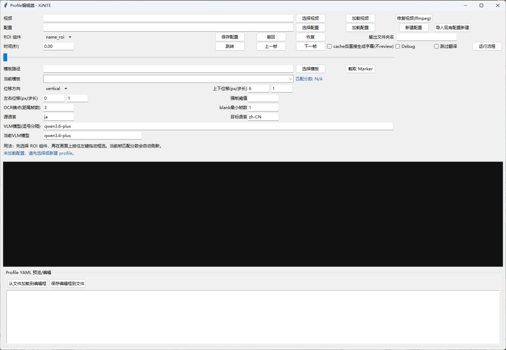
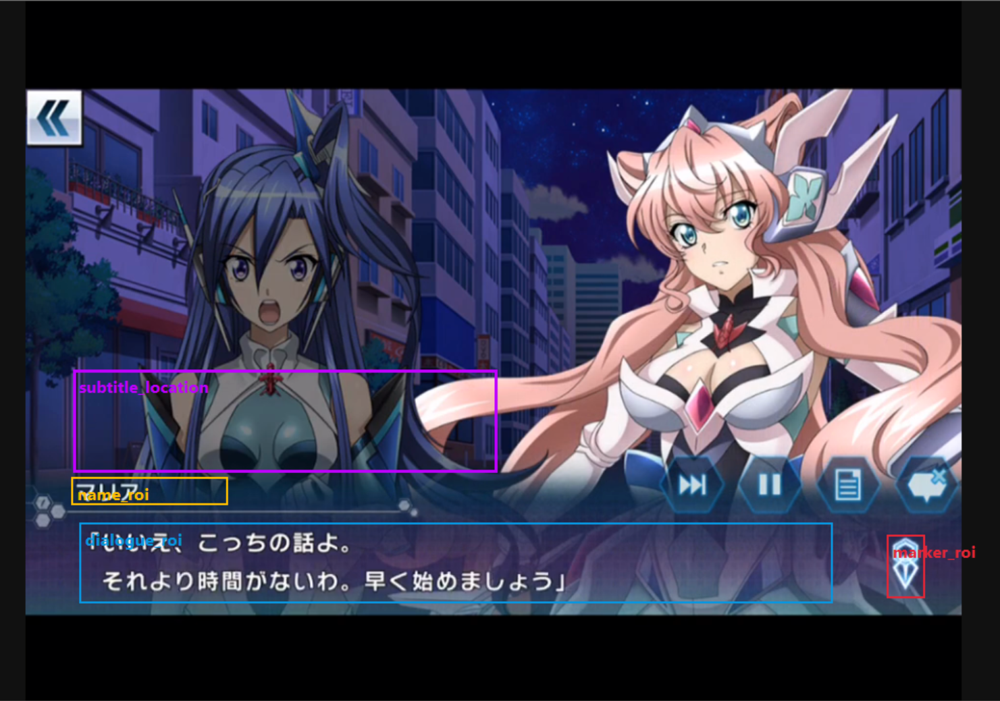
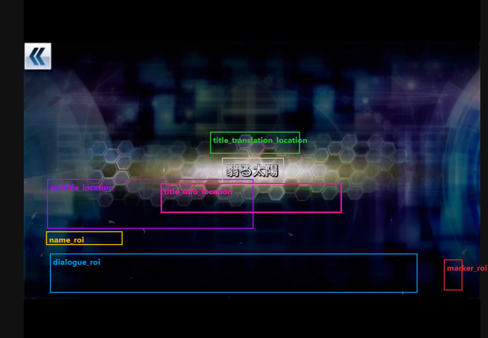
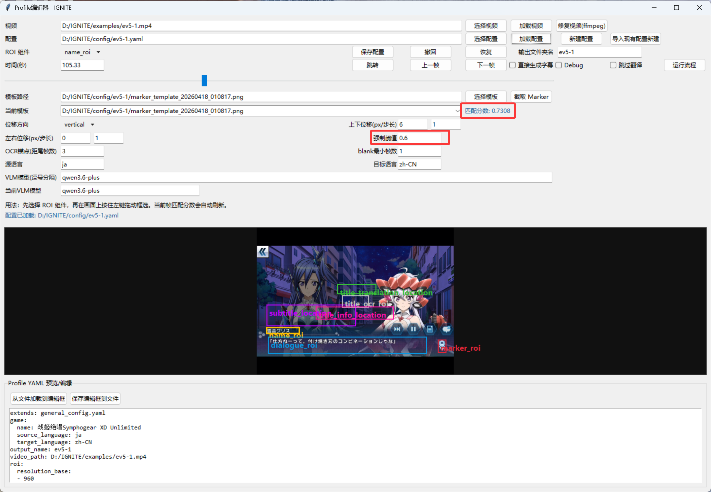
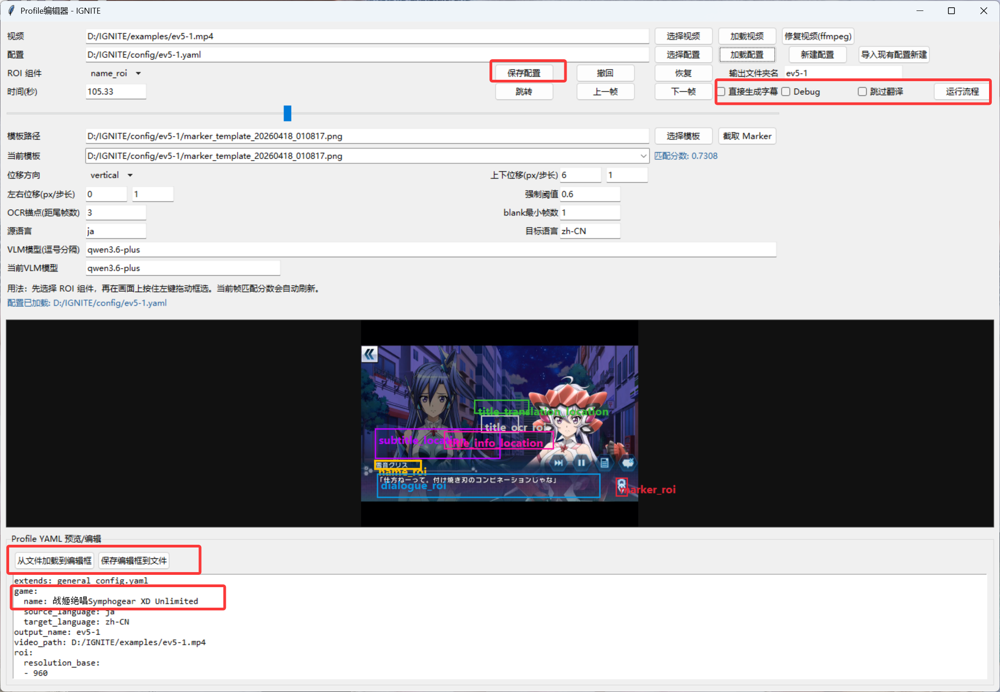
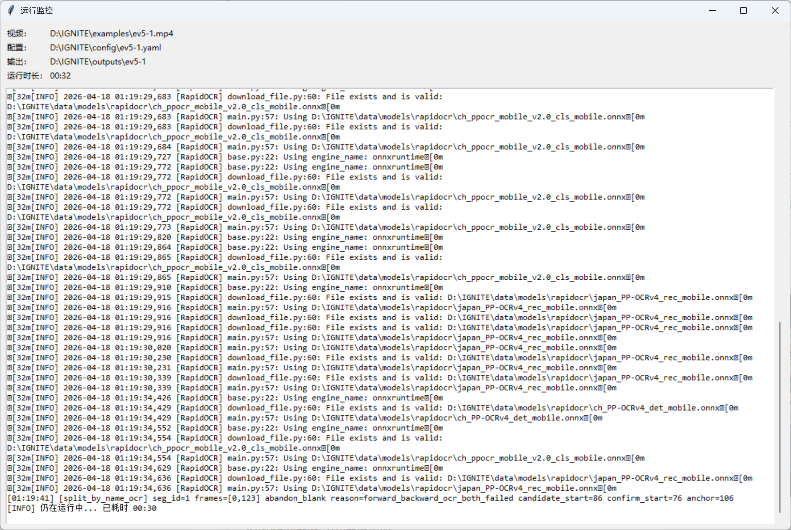
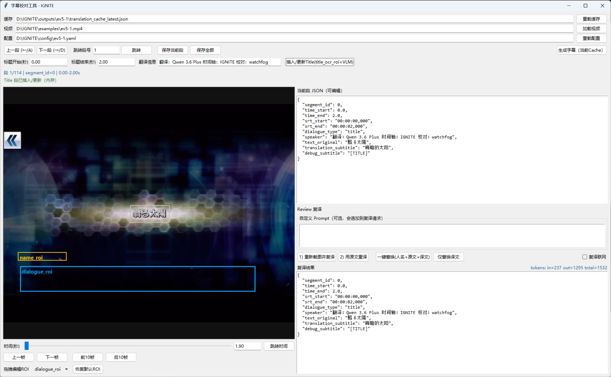
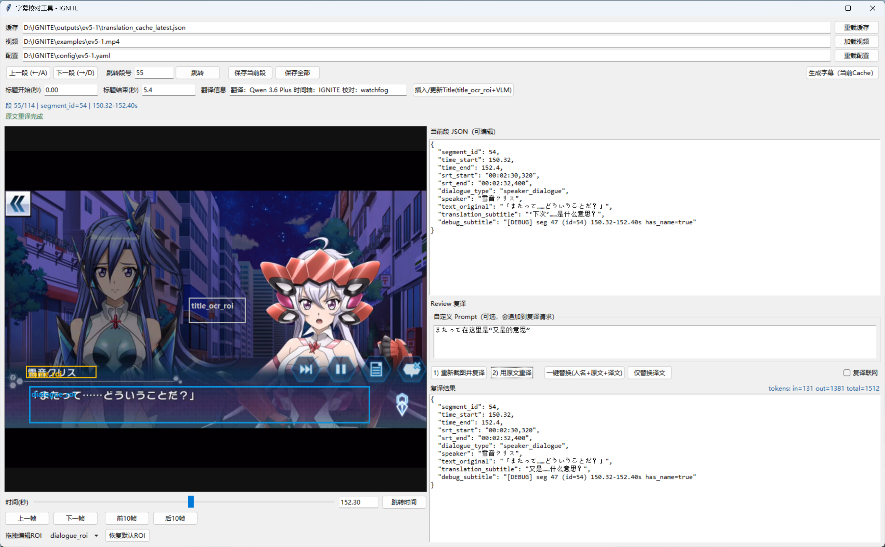
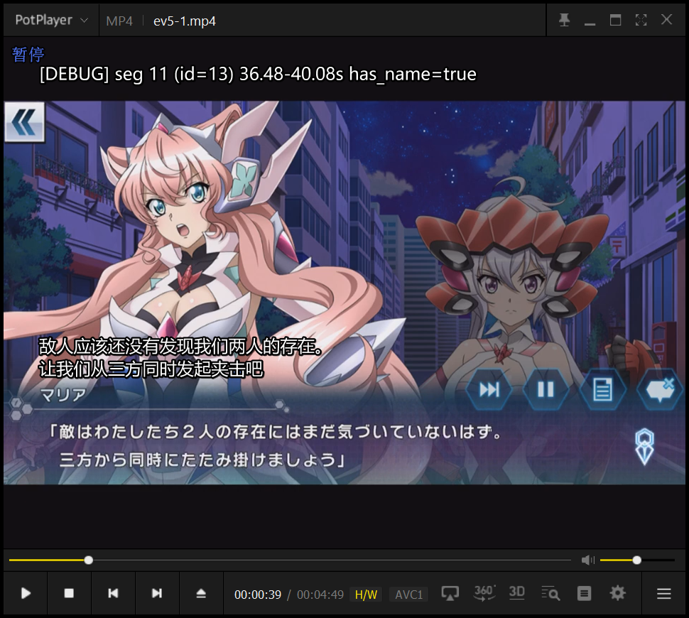

# IGNITE

> **I**ndexing, reco**G**nition, tra**N**slation, rev**I**ew and subti**T**l**E**ing

IGNITE 是一个面向游戏剧情视频的字幕流水线工具。目标是针对**画面文字驱动**的游戏剧情录屏，使用OCR配合VLM自动化完成时间轴、文本识别、翻译，经人工校对和字幕导出的GUI工具。

## 功能概览

- 基于视频画面自动分段并生成时间轴
- 使用VLM完成识别/翻译
- 生成可编辑的翻译缓存
- 基于缓存进行GUI审查，支持人工复核翻译内容/重译/时间点编辑等功能
- 从缓存生成字幕 **.ass/srt**

## 依赖与环境

### 拉取仓库

```bash
git clone https://github.com/watchfog/IGNITE.git
cd IGNITE
```

或

从网页端下载

### Python 依赖安装

```bash
pip install -r requirements.txt
```

默认依赖包括：

- `rapidocr` + `onnxruntime`：OCR 运行时
- `opencv-python`：视频读取与图像处理
- `Pillow`：Tk GUI 图像显示
- `PyYAML`：读取配置
- `requests`：访问在线模型接口

`Tkinter` 通常随 Windows 官方 Python 一起安装；如果是 Linux，通常需要额外安装系统包，例如 `python3-tk`。

### FFmpeg 配置

本项目依赖 FFmpeg 进行取帧和精确预览。默认配置路径写在 `config/general_config.yaml` 的 `tools` 段中：

- `tools.ffmpeg_path`
- `tools.ffprobe_path`

默认值在相对路径`tools/ffmpeg/bin/`下，如果有需要可以指定外部绝对路径

可以自行编译ffmpeg的源码，或采用编译好分发的二进制文件，见[FFmpeg官方文档](https://ffmpeg.org/download.html)。

### VLM 配置

VLM相关配置在`config/general_config.yaml`中的`translation`部分

必须先配置`translation.api_key_file`指向包含API密钥的文件。

默认使用阿里云百炼的openai兼容地址 `https://dashscope.aliyuncs.com/compatible-mode/v1`，采用`Qwen 3.6 Plus`模型，`responses`模式。

API通过`translation.vlm_api`参数指定，模型通过 `translation.model` 参数指定，model必须在`translation.vlm_models`列表中。

注意使用的模型必须带有视觉识别功能且支持`responses`模式调用。

## GUI使用流程

### 0. 配置 `config/general_config.yaml`

除了VLM配置外，其他参数见注释，基本不需要更改。

### 1. 启动主 GUI

```bash
python main.py --video [VIDEO] --config [PROFILE] 
```

也可以不指定 `--video` 和 `--config`，直接运行 `python main.py` 启动 GUI 后再选择视频和配置文件。

### 2. 在 Profile 编辑器 GUI 中进行配置

不传入参数时的GUI界面如下



首先点击视频右侧的选择，选择目标翻译视频;
然后点击配置右侧的新建配置，或从现有配置导入

新建完成后，选取ROI组件，并在视频预览上拖动框选。注意如果视频GOP间隔过大，拖动时的预览可能与实际不符，请等待加载完成。

组件包括7种，分别为

- `name_roi` 人名位置
- `dialogue_roi` 对话位置
- `marker_roi` 对话结束标记位置
  - 区域在完整包裹marker（包括浮动）的前提下，越小越好。
  - 在预览图稳定后，点击截取Marker，并保存截图，用于模板匹配。默认会在config/下新建与视频同名的文件夹
  - 对于浮动较大的Marker，可以选择截取多次，或配置位移方向，或同时使用两者
- `subtitle_location` 字幕放置位置，实际上以左下角为锚点
- `title_ocr_roi` 标题位置
- `title_translation_location` 标题翻译位置，居中
- `title_info_location` 翻译信息，如翻译时间轴校对等等





接下来拖动进度条，查看marker不同位置的marker匹配分数。根据匹配分数配置下面的强制阈值，一般建议为0.6。

如果在有marker的位置匹配分数仍然很低，建议确定marker_roi范围是否合理，以及多次截取marker并保存，选取多个模板用于匹配。

如果拖动视频非常**卡顿**的话，请点击修复视频(ffmpeg)尝试自动修复。问题常出现在**流媒体平台**下载的视频中



其他选项可以暂时不用管，有兴趣的可以自行了解。

完成后，点击保存配置，在下面的预览框中的`name`处，填入游戏名字，用于告知VLM相关背景信息。注意较新的游戏受限于VLM知识，可能效果不佳，可能需要开启联网搜索。

填入完成后，点击保存编辑框到文件。

然后修改输出文件夹名（如有需要），默认与视频名相同。

根据需要选择参数，如果不想review结果直接生成字幕，可以勾选cache后直接生成字幕；勾选Debug会保存更多中间结果，用于解决分段错误问题；skip translation用于跳过VLM翻译，也就是只打时间轴。

最后点击运行流程，会弹出新窗口，开始运行识别和翻译。



### 3. 等待流程运行完毕

- 第一阶段程序会根据Marker匹配结果进行较粗的划分

- 第二阶段通过OCR姓名部分是否存在进一步切分，目的是让字幕与说话人同步出现

- 第三阶段通过API，将姓名和对话部分截图传给VLM进行识别和翻译，并格式化保存至缓存中

流程耗时根据视频分辨率、划分段数、文本量和电脑性能有关，一般为视频长度的2倍左右。

token消耗根据视频分辨率和文本量有所不同，我测试的视频720p大约每分钟不到25k，其中输入输出约为1:1.5，按百炼平台Qwen 3.6 Plus的价格大约0.2元，使用前请保证API余额充足。使用batch调用或者用其他模型价格会有所降低，但我没有进一步测试其他模型的翻译效果。



### 4. 结果校对

运行完成后会弹出字幕校对工具，目前支持的功能有

- 标题插入
- 编辑字幕时间、翻译
- 重译（重新截图/原文本）



对标题插入功能，首先通过预览或其他方式确定标题开始时间和结束时间，将时间轴拖动到有标题文字的画面，填写翻译信息后点击插入/更新标题按钮，等待右下角出现翻译结果即可。

点击按钮上一段/下一段可以在不同字幕段之间切换，并编辑JSON。
注意这个跳转性能极差，快速点击会导致GUI卡死。如果需要快速预览效果，建议先生成字幕在播放器中预览，配合debug字幕定位后回来编辑。

也可以再次调用VLM来进行翻译，可以要求重新截图并复译（针对roi未框选准的情况，或认为文字识别错误），或直接用识别的原文复译。
此外，还可以填入额外的自定义Prompt提供补充信息，以及开启联网搜索功能。



点击重译后，等待结果返回，可以选择直接替换上去（全部替换/仅替换译文），也可以自己编辑。

编辑后，可以点击保存当前段，也可以最后直接保存全部。

如果不小心关闭此界面，可以通过`python app/cache_browser_review.py --cache [CACHE]`来重新启动。
在`outputs/[指定的输出路径]`下，有`translation_cache_latest.json`，是最近一次运行的结果；
在`outputs/[指定的输出路径]/work/run_cache_[时间]`下，有`translation_cache.json`，是当次运行的结果。
注意只保留3次运行结果，如有需要请及时备份。

如果在有cache的情况下运行步骤2和3，如果发现有时间段完全一致的片段，则会直接使用cache中的内容，不会再次调用VLM去识别。

### 5. 生成字幕

确认当前结果无误后，点击生成字幕，即可在指定的目录下得到字幕文件，包括`.ass/.srt`两种格式。

最终输出通常包括：

- `subtitles.srt`
- `subtitles.ass`
- `subtitles_debug.srt`
- `subtitles_debug.ass`

其中debug版本仅包含识别信息，用于辅助确认当前字幕的所在的`segment_id`，方便在校对工具中调用。

利用potplayer或类似播放器的主副字幕功能可以快速定位存在问题的字幕位置。



## 未来工作

- 可在字幕校对工具中插入字幕段
- 可选的人名字幕
- 可配置的字幕样式
- 预览性能优化
- 更多分段方式选择
- 实时识别

以上工作能否完成取决于我个人兴趣和时间~~和Codex配额~~

## 开源协议

本项目基于 GNU General Public License v3.0 协议开源
